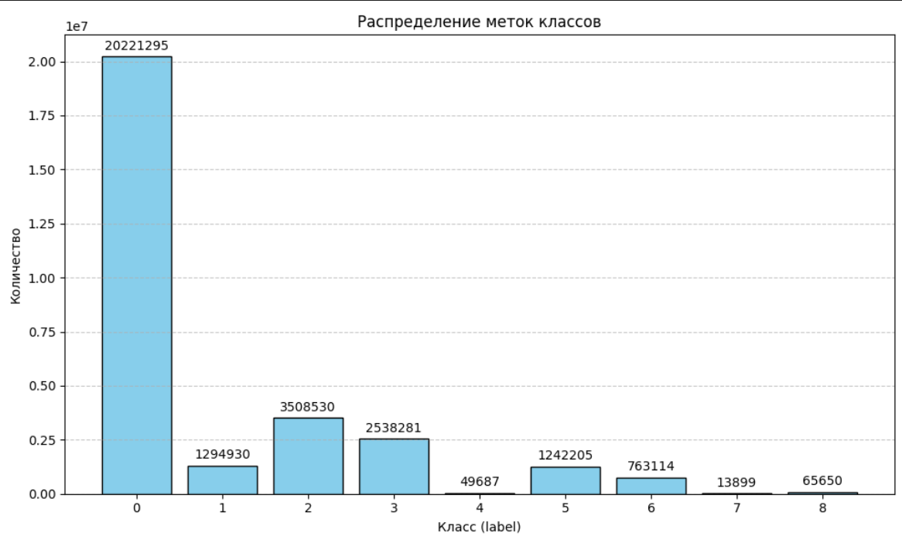

### Отчет: 
При запуске скрипита
 ```bash 
 python .\lab4\task1\main.py
 ```
 Следующий вывод: 

 ```bash 
 Обработано 29697591 точек. Размер: (29697591, 8), dtype: float64
 Сохранено: .npy, _head1000.txt, .h5

 Первые 5 строк:
[[ 1.78632456  3.59638421 -0.48669514  0.49803922  0.55294118  0.60392157
   0.19296403  0.        ]
 [ 1.76212791  3.60562678 -0.56343714  0.50980392  0.55294118  0.62352941
   0.21659228  0.        ]
 [ 1.7619425   3.60572014 -0.61555776  0.54509804  0.59215686  0.64705882
   0.17931216  6.        ]
 [ 1.7632404   3.60487991 -0.61651703  0.51372549  0.57647059  0.63921569
   0.16907325  0.        ]
 [ 1.76305499  3.60478655 -0.61651703  0.51764706  0.56862745  0.63137255
   0.1577842   0.        ]]
```
На основе построенной диаграммы можно сделать вывод, что класс 0 составляет более 78% всех точек.
Классы 4, 7 — крайне редкие (< 0.2%).
График наглядно демонстрирует, что данные требуют предварительной подготовки для обучения нейронных сетей. Для редких классов важно проводит агументацию и провести ** undersampling** доминирующего класса 0



### **1. Определение, характеристики и назначение Semantic3D**

**Semantic3D** — это крупномасштабный датасет для **семантической сегментации 3D-облаков точек**, полученных с помощью наземного (mobile/terrestrial) LiDAR-сканирования уличных сцен (городские улицы, парки, ж/д станции и т.п.).

**Основные характеристики**:
- **Объем**: >4 млрд точек в обучающей + валидационной части, >1.7 млрд — в тестовой.
- **Число сцен**: 30 обучающих (`train` + `reduced-8` + `validation`) и 15 тестовых сцен.
- **Тип данных**: неструктурированные облака точек с координатами `(x, y, z)`, интенсивностью отражения (`intensity`) и RGB (в большинстве сцен — _не предоставлен_; часть сцен имеет цвет от фотограмметрии).
- **Разметка**: точечная (per-point), 8 семантических классов.
- **Формат**: `.txt` (ASCII), один файл = одна сцена.

**Назначение**:  
- Семантической сегментации наружных LiDAR-облаков точек,
- Бенчмаркинга 3D-нейросетей (PointNet++, RandLA-Net, KPConv и др.),
- Исследования устойчивости моделей к шуму, изменению плотности, масштабу.

---

### **2. Отличия от ImageNet и S3DIS**

| Критерий       | **ImageNet**                   | **S3DIS**                          | **Semantic3D**                                                                |
| -------------- | ------------------------------ | ---------------------------------- | ----------------------------------------------------------------------------- |
| **Тип данных** | 2D изображения (RGB)           | Внутренние 3D-сканы (RGB-D)        | Наружные 3D-сканы (LiDAR + intensity)                                         |
| **Источник**   | Фотографии (смартфоны, камеры) | Kinect / Matterport (в помещениях) | Наземный/мобильный LiDAR (улицы)                                              |
| **Масштаб**    | ~1.2M изображений              | ~270 комнат (6 зон)                | 45 сцен, >4 млрд точек                                                        |
| **Плотность**  | Равномерная (пиксели)          | Высокая и однородная               | Неравномерная, убывает с расстоянием                                          |
| **Геометрия**  | Проекция 3D → 2D               | Ограниченные, "замкнутые" сцены    | Открытые, бесконечные, масштабные сцены                                       |
| **Шум**        | Низкий (JPEG, motion blur)     | Умеренный (отражения, пропуски)    | Высокий (движение сканера, динамические объекты, отражения от стекла/листьев) |
| **Классы**     | 1000 объектов (ImageNet)       | 13 объектов интерьера              | 8 классов городской инфраструктуры                                            |
**Ключевое отличие**:  
Semantic3D — **первый открытый датасет для _наружной_ семантической сегментации LiDAR-данных**, с реалистичными вызовами: **огромный объём**, **движение сканера**, **динамические объекты**, **отсутствие цвета**, **экстремальная неравномерность плотности**.

---

### **3. Состав и структура датасета**
Датасет содержит **45 сцен**, разделённых на:

|Множество|Кол-во сцен|Кол-во точек|Назначение|
|---|---|---|---|
|**`train` (full)**|15|~3.0 млрд|Основной обучающий набор (редко используется целиком из-за размера)|
|**`reduced-8`**|8 (подмножество `train`)|~160 млн|Мини-набор для быстрого прототипирования (рекомендуется для старта)|
|**`validation`**|7 (оставшиеся из `train`)|~1.0 млрд|Валидация гиперпараметров|
|**`test`**|15|~1.7 млрд|Тестирование (разметка _недоступна_; отправка на сервер через leaderboard)|

**Формат файлов**:
- `*.txt` — координаты `(x y z)` + `intensity` (и иногда `r g b`, но _не всегда_).
- `*.labels` — разметка (только для `train`/`validation`): один `int` на точку.
- Тестовые сцены (`*.txt` без `.labels`) — отправляются на [официальный сервер](http://semantic3d.net/) для оценки.

---
### **4. Способ получения данных и его влияние**

**Технология**:  
Сцены получены с помощью **наземных и мобильных LiDAR-систем**:
- Трехмерные сканеры (Velodyne HDL-64E, Riegl, FARO и др.),
- Установлены на автомобили, тележки или штативы,
- Сканирование в реальных городских условиях (день/ночь, разное освещение, движущиеся пешеходы/машины).

 **Влияние на характеристики облаков точек**:

|Характеристика|Причина|Последствия|
|---|---|---|
|**Неравномерная плотность**|Угол обзора, расстояние до объекта, скорость сканера|Ближние объекты — густые, дальние — разреженные → смещение внимания модели|
|**Шум и выбросы**|Отражения от стекла, листвы, пыли, дождя; движение|"Призрачные" точки, артефакты → ложные срабатывания|
|**Отсутствие цвета**|LiDAR не регистрирует цвет (только интенсивность)|Ограниченная текстурная информация → сложнее различать похожие по форме объекты (стена vs забор)|
|**Динамические объекты**|Прохожие, машины|Разметка часто "заморожена" или удалена → пропуски, несоответствия|
|**Большой масштаб**|Открытые улицы, сотни метров в длину|Трудности с обработкой целиком → необходимость блоков / тайлов|

---

### **5. 8 семантических классов**

|№|Класс|Описание|Примеры объектов|
|---|---|---|---|
|0|**unlabeled**|Неразмеченные / артефактные точки|Тень, шум, динамические объекты (люди/машины), пропуски|
|1|**man-made terrain**|Антропогенный рельеф|Асфальт, бетонные площадки, тротуары, набережные|
|2|**natural terrain**|Естественный рельеф|Земля, почва, газоны, песок, поля|
|3|**high vegetation**|Высокая растительность|Деревья (стволы и кроны), кустарники >1.5 м|
|4|**low vegetation**|Низкая растительность|Трава, цветы, мелкие кусты, клумбы|
|5|**buildings**|Здания|Стены, крыши, окна, балконы (но не детали вроде дверей)|
|6|**hard scape**|Твёрдые элементы благоустройства|Заборы, столбы, фонари, скамейки, урны, дорожные знаки|
|7|**scanning artefacts**|Артефакты сканирования|"Призрачные" лучи, отражения (например, от окон), выбросы|
|8|**cars**|Автомобили|Стоящие и движущиеся машины (часто частично размечены или удалены)|

---
### **6. Проблемы разметки**

- **"Шум" в разметке**:  
    Некоторые точки от динамических объектов (люди, машины) или артефактов получают метки классов (например, `man-made terrain`), что вводит модель в заблуждение.
- **Неоднозначность границ**:  
    Границы между `low vegetation` и `natural terrain`, или `hard scape` и `buildings`, часто субъективны → разметка зависит от аннотатора.
- **Пропуски (missing labels)**:  
    Динамические объекты часто **удаляются из облака** перед разметкой → дыры, разрывы → модель учится игнорировать "неполные" области.
- **Артефакты сканирования**:  
    Точки, появившиеся из-за многократных отражений (например, в окна), могут быть неправильно размечены как `buildings` или `hard scape`.
- **Масштаб разметки**:  
    Ручная разметка миллиардов точек невозможна → использовались semi-автоматические методы + правка → ошибки накапливаются.

---

### **7. Технические проблемы при работе с объёмом**

|Проблема|Описание|
|---|---|
|**Память (RAM/GPU)**|Загрузка всей сцены (~200 млн точек) требует >10 ГБ RAM; обработка батчей — OOM на GPU|
|**Время обработки**|Инференс на полной сцене может занимать часы|
|**Дисковое I/O**|Чтение/запись TB данных — узкое место без SSD/NVMe|
|**Параллелизация**|Нельзя просто брать случайные точки — нужно сохранять локальную структуру → сложное сэмплирование|
|**Нормализация по сцене**|Нельзя глобально нормализовать (разные сцены — разные масштабы) → локальная нормализация по блокам|

**Решения**:

- Тайлинг (разбиение сцены на блоки 20×20 или 50×50 м),
- Даунсэмплинг (voxel grid / random),
- Lazy loading (чтение по частям),
- Использование `torch.utils.data.IterableDataset`.

---
### **8. Неравномерная плотность и её последствия**

**Неравномерная плотность** — явление, при котором количество точек на единицу площади/объёма сильно варьируется в зависимости от:

- расстояния до сканера (по закону обратных квадратов),
- угла падения лазерного луча,
- свойств поверхности (поглощение vs отражение).

**Проблемы при обучении**:

- Модель **переобучается на ближних, густых объектах** (машины, бордюры), игнорируя дальние (крыши, деревья).
- Локальные операторы (например, `k-NN` с фиксированным `k`) в разреженных областях "ловят" далёкие точки → искажение признаков.
- Высокий variance в градиентах → нестабильное обучение.
- Метрики (IoU) искажаются: классы с высокой плотностью (дорога) доминируют.

**Решения**:

- Адаптивный `k` (например, `k = max(16, round(density * const))`),
- Voxel-based даунсэмплинг (равномерная плотность в вокселях),
- Аугментация: имитация разреженности (random dropout по радиусу).

---

### **9. Несбалансированность классов**

**Статистика (примерная, зависит от сцены)**:

|Класс|Доля точек|
|---|---|
|`man-made terrain`|~30–40%|
|`natural terrain`|~15–25%|
|`buildings`|~10–20%|
|`high vegetation`|~10–20%|
|`low vegetation`|~5–10%|
|`hard scape`, `cars`, `scanning artefacts`|<5% каждый|

**Влияние**:

- Модель максимизирует **общую точность (OA)**, "жертвуя" редкими классами → высокая OA, но низкий mIoU.
- mIoU **сильно страдает** из-за низкого IoU для `cars`, `hard scape`, `artefacts`.
- Cross-Entropy **без весов** игнорирует редкие классы.

**Решения**:

- Взвешенный Cross-Entropy: `weight = 1 / sqrt(freq)`,
- Focal Loss,
- Oversampling редких классов при сэмплировании блоков,
- Отдельная нормализация loss по классам.

---

### **10. Этапы предобработки Semantic3D**

1. **Загрузка и фильтрация**:
    - Чтение `.txt` → `(N, 4)` = `[x, y, z, intensity]`,
    - Удаление точек с `intensity = 0` (шум/выбросы),
    - (Опционально) удаление `unlabeled` точек для обучения.
2. **Нормализация координат**:
    - Центрирование каждой сцены: `xyz -= centroid`,
    - Масштаб: `xyz /= max_range` → [-0.5, 0.5] или std = 1.
3. **Даунсэмплинг**:
    - **Voxel Grid Downsampling** (рекомендуется): размер вокселя ~5–10 см — обеспечивает равномерную плотность.
    - Альтернатива: random subsampling до фикс. кол-ва точек (но теряется геометрия).
4. **Разбиение на блоки (tiling)**:
    - Оконное разбиение (например, 20×20×10 м) с перекрытием (25%) для уменьшения граничных артефактов.
5. **Аугментация** (во время обучения):
    - Поворот вокруг оси Z (наружные сцены инвариантны к yaw),
    - Джиттер координат (±2–5 см),
    - Изменение интенсивности (±20%),
    - Дропаут точек (random или по радиусу).
6. **Балансировка**:
    - Oversampling блоков с редкими классами (`cars`, `hard scape`),
    - Или weighted sampling при формировании батчей.
7. **Кэширование**:  
    Сохранение предобработанных блоков в `.npy` или `.h5` для ускорения даталоадера